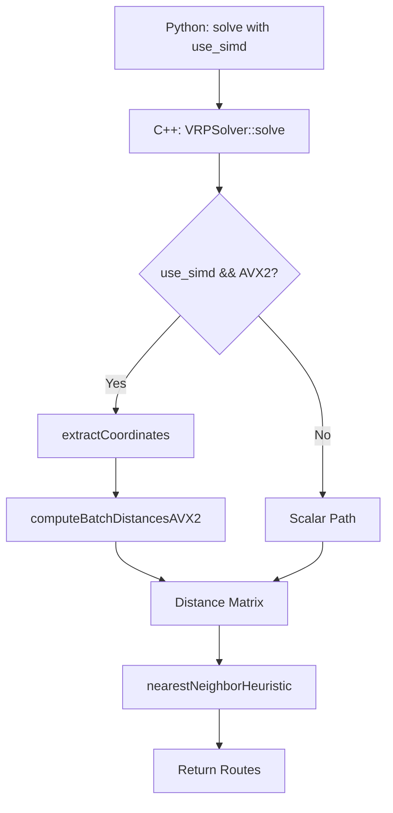

# Design Document: AVX2 Distance Optimization

## Overview

This design implements SIMD (Single Instruction, Multiple Data) optimizations for distance calculations in the VRP Solver using AVX2 intrinsics. The optimization parallelizes distance computations at the CPU level by processing 4 customer pairs simultaneously in 256-bit vector registers, targeting a 2-3x speedup for distance matrix construction.

The key insight is that distance calculations are embarrassingly parallel - each distance computation is independent. By transforming the data layout from Array of Structures (AoS) to Structure of Arrays (SoA) temporarily, we enable efficient vectorized operations on contiguous memory.

### Design Approach

1. **Euclidean Approximation**: Use simplified distance formula `sqrt((lat2-lat1)^2 + (lon2-lon1)^2)` instead of Haversine, as AVX2 lacks hardware trigonometric functions
2. **Temporary SoA Transform**: Extract coordinates into separate arrays only during distance matrix construction
3. **Dual Path Architecture**: Maintain both SIMD and scalar implementations with runtime selection
4. **Minimal API Changes**: Add optional `use_simd` parameter while preserving backward compatibility

## Architecture

### High-Level Flow

```
VRPSolver::solve(customers, capacity, use_simd=true)
  ↓
buildDistanceMatrix(customers, use_simd)
  ↓
if (use_simd && has_avx2_support())
  ↓
  extractCoordinates(customers) → lats[], lons[]
  ↓
  computeBatchDistancesAVX2(lats, lons) → distance_matrix
  ↓
else
  ↓
  computeDistancesScalar(customers) → distance_matrix
  ↓
nearestNeighborHeuristic(distance_matrix) → routes
```

### Component Interaction



## Components and Interfaces

### 1. VRPSolver Class (Modified)

**File**: `include/solver.h`

**Public Interface Changes**:

```cpp
class VRPSolver {
public:
    // Modified method signature
    std::vector<Route> solve(
        const std::vector<Customer>& customers,
        double capacity,
        bool use_simd = true  // NEW: SIMD toggle
    );
    
    // Existing methods unchanged
    // ...
};
```

**Private Method Additions**:

```cpp
private:
    // Modified to accept use_simd flag
    void buildDistanceMatrix(
        const std::vector<Customer>& customers,
        bool use_simd
    );
    
    // NEW: Extract coordinates into SoA layout
    void extractCoordinates(
        const std::vector<Customer>& customers,
        std::vector<double>& lats,
        std::vector<double>& lons
    );
    
    // NEW: AVX2 vectorized distance computation
    void computeBatchDistancesAVX2(
        const std::vector<double>& lats,
        const std::vector<double>& lons,
        size_t from_idx,
        size_t to_idx
    );
    
    // NEW: Euclidean approximation (scalar)
    double euclideanDistance(
        double lat1, double lon1,
        double lat2, double lon2
    ) const;
    
    // NEW: CPU feature detection
    bool hasAVX2Support() const;
    
    // Existing: Haversine distance (kept for reference)
    double haversineDistance(
        double lat1, double lon1,
        double lat2, double lon2
    ) const;
```

### 2. Coordinate Extraction

**Purpose**: Transform AoS to SoA for SIMD efficiency

**Implementation**:

```cpp
void VRPSolver::extractCoordinates(
    const std::vector<Customer>& customers,
    std::vector<double>& lats,
    std::vector<double>& lons
) {
    size_t n = customers.size();
    lats.resize(n);
    lons.resize(n);
    
    for (size_t i = 0; i < n; ++i) {
        lats[i] = customers[i].location.latitude;
        lons[i] = customers[i].location.longitude;
    }
}
```

**Complexity**: O(n) time, O(n) space

### 3. AVX2 Batch Distance Computation

**Purpose**: Compute 4 distances simultaneously using 256-bit registers

**Key Intrinsics Used**:

- `_mm256_loadu_pd`: Load 4 doubles (unaligned)
- `_mm256_sub_pd`: Subtract 4 doubles
- `_mm256_mul_pd`: Multiply 4 doubles
- `_mm256_add_pd`: Add 4 doubles
- `_mm256_sqrt_pd`: Square root of 4 doubles
- `_mm256_storeu_pd`: Store 4 doubles (unaligned)

**Algorithm**:

```
For each batch of 4 customers (i, i+1, i+2, i+3):
  1. Load 4 latitudes from reference point into register: lat_ref_vec
  2. Load 4 latitudes from batch into register: lat_batch_vec
  3. Compute delta: dlat = lat_batch_vec - lat_ref_vec
  4. Load 4 longitudes from reference point into register: lon_ref_vec
  5. Load 4 longitudes from batch into register: lon_batch_vec
  6. Compute delta: dlon = lon_batch_vec - lon_ref_vec
  7. Compute: dlat_sq = dlat * dlat
  8. Compute: dlon_sq = dlon * dlon
  9. Compute: sum = dlat_sq + dlon_sq
  10. Compute: dist = sqrt(sum)
  11. Store 4 distances to distance matrix
```

**Implementation Sketch**:

```cpp
void VRPSolver::computeBatchDistancesAVX2(
    const std::vector<double>& lats,
    const std::vector<double>& lons,
    size_t from_idx,
    size_t to_idx
) {
    double lat1 = lats[from_idx];
    double lon1 = lons[from_idx];
    
    // Broadcast reference point to all 4 lanes
    __m256d lat1_vec = _mm256_set1_pd(lat1);
    __m256d lon1_vec = _mm256_set1_pd(lon1);
    
    size_t i = to_idx;
    size_t n = lats.size();
    
    // Process 4 at a time
    for (; i + 3 < n; i += 4) {
        // Load 4 latitudes and longitudes
        __m256d lat2_vec = _mm256_loadu_pd(&lats[i]);
        __m256d lon2_vec = _mm256_loadu_pd(&lons[i]);
        
        // Compute deltas
        __m256d dlat = _mm256_sub_pd(lat2_vec, lat1_vec);
        __m256d dlon = _mm256_sub_pd(lon2_vec, lon1_vec);
        
        // Square deltas
        __m256d dlat_sq = _mm256_mul_pd(dlat, dlat);
        __m256d dlon_sq = _mm256_mul_pd(dlon, dlon);
        
        // Sum and sqrt
        __m256d sum = _mm256_add_pd(dlat_sq, dlon_sq);
        __m256d dist = _mm256_sqrt_pd(sum);
        
        // Store results
        double results[4];
        _mm256_storeu_pd(results, dist);
        
        for (int j = 0; j < 4; ++j) {
            distanceMatrix[from_idx][i + j] = results[j];
            distanceMatrix[i + j][from_idx] = results[j]; // Symmetric
        }
    }
    
    // Handle remainder with scalar code
    for (; i < n; ++i) {
        double dist = euclideanDistance(lat1, lon1, lats[i], lons[i]);
        distanceMatrix[from_idx][i] = dist;
        distanceMatrix[i][from_idx] = dist;
    }
}
```

### 4. Euclidean Distance (Scalar)

**Purpose**: Simplified distance formula compatible with AVX2 operations

**Implementation**:

```cpp
double VRPSolver::euclideanDistance(
    double lat1, double lon1,
    double lat2, double lon2
) const {
    double dlat = lat2 - lat1;
    double dlon = lon2 - lon1;
    return std::sqrt(dlat * dlat + dlon * dlon);
}
```

**Note**: This is an approximation. For small geographic areas, it's reasonably accurate. For global routing, consider scaling factors or keeping Haversine for scalar path.

### 5. CPU Feature Detection

**Purpose**: Detect AVX2 support at runtime

**Implementation Options**:

**Option A: Compiler Built-ins (GCC/Clang)**:
```cpp
bool VRPSolver::hasAVX2Support() const {
    #if defined(__AVX2__)
        return true;
    #else
        return false;
    #endif
}
```

**Option B: Runtime Detection (More Robust)**:
```cpp
#include <cpuid.h>

bool VRPSolver::hasAVX2Support() const {
    #if defined(__x86_64__) || defined(_M_X64)
        unsigned int eax, ebx, ecx, edx;
        if (__get_cpuid(7, &eax, &ebx, &ecx, &edx)) {
            return (ebx & bit_AVX2) != 0;
        }
    #endif
    return false;
}
```

**Recommendation**: Use Option B for production, Option A for initial implementation.

### 6. Modified buildDistanceMatrix

**Purpose**: Route to SIMD or scalar path based on configuration

**Implementation**:

```cpp
void VRPSolver::buildDistanceMatrix(
    const std::vector<Customer>& customers,
    bool use_simd
) {
    size_t n = customers.size();
    distanceMatrix.assign(n, std::vector<double>(n, 0.0));
    
    if (use_simd && hasAVX2Support()) {
        // SIMD path
        std::vector<double> lats, lons;
        extractCoordinates(customers, lats, lons);
        
        for (size_t i = 0; i < n; ++i) {
            distanceMatrix[i][i] = 0.0;
            computeBatchDistancesAVX2(lats, lons, i, i + 1);
        }
    } else {
        // Scalar path (existing or Euclidean)
        for (size_t i = 0; i < n; ++i) {
            for (size_t j = i + 1; j < n; ++j) {
                double dist = euclideanDistance(
                    customers[i].location.latitude,
                    customers[i].location.longitude,
                    customers[j].location.latitude,
                    customers[j].location.longitude
                );
                distanceMatrix[i][j] = dist;
                distanceMatrix[j][i] = dist;
            }
        }
    }
}
```

### 7. Python Bindings Update

**File**: `src/bindings.cpp`

**Modified Binding**:

```cpp
#include <nanobind/nanobind.h>
#include <nanobind/stl/vector.h>
#include "solver.h"

namespace nb = nanobind;

NB_MODULE(vrp_core, m) {
    // ... existing bindings ...
    
    nb::class_<VRPSolver>(m, "VRPSolver")
        .def(nb::init<>())
        .def("solve",
             &VRPSolver::solve,
             nb::arg("customers"),
             nb::arg("capacity"),
             nb::arg("use_simd") = true,  // NEW: default true
             "Solve VRP with optional SIMD optimization");
}
```

## Data Models

### Existing Data Structures (Unchanged)

```cpp
struct Location {
    double latitude;
    double longitude;
};

struct Customer {
    int id;
    Location location;
    double demand;
    double ready_time;
    double due_time;
    double service_time;
};
```

### Temporary Data Structures (SIMD Path Only)

```cpp
// Created temporarily in buildDistanceMatrix
std::vector<double> lats;  // Extracted latitudes
std::vector<double> lons;  // Extracted longitudes
```

**Memory Layout**:

**Before (AoS)**:
```
customers[0]: {id, lat, lon, demand, ...}
customers[1]: {id, lat, lon, demand, ...}
customers[2]: {id, lat, lon, demand, ...}
```

**During SIMD (SoA)**:
```
lats: [lat0, lat1, lat2, lat3, ...]
lons: [lon0, lon1, lon2, lon3, ...]
```

This enables efficient `_mm256_loadu_pd(&lats[i])` to load 4 consecutive values.


## Correctness Properties

*A property is a characteristic or behavior that should hold true across all valid executions of a system—essentially, a formal statement about what the system should do. Properties serve as the bridge between human-readable specifications and machine-verifiable correctness guarantees.*

### Property 1: Coordinate Extraction Preserves Data

*For any* list of customers, when coordinates are extracted into separate latitude and longitude arrays, the extracted arrays should have the same length as the customer list, and for each index i, lats[i] should equal customers[i].location.latitude and lons[i] should equal customers[i].location.longitude.

**Validates: Requirements 1.1, 1.2, 1.3**

**Rationale**: This property ensures the SoA transformation correctly preserves all coordinate data in the correct order. This is foundational for SIMD correctness—if coordinates are extracted incorrectly, all subsequent distance calculations will be wrong.

### Property 2: Input Immutability

*For any* customer list, after calling solve() with SIMD enabled, the original customer vector should remain completely unchanged (all fields of all customers identical to their original values).

**Validates: Requirements 1.4**

**Rationale**: The SoA transformation should be non-destructive. This ensures the solver can be called multiple times with the same input data, and that the input data can be safely reused after solving.

### Property 3: SIMD and Scalar Path Equivalence

*For any* customer list and capacity, when solving with use_simd=true and use_simd=false, the computed distance matrices should be identical within 0.01% relative error for all non-zero distances.

**Validates: Requirements 3.1**

**Rationale**: This is the critical correctness property for the optimization. Both paths must produce the same results (within floating-point tolerance) to ensure the SIMD optimization doesn't introduce bugs. This property subsumes the requirement that both paths use the same Euclidean formula.

### Property 4: Distance Matrix Symmetry

*For any* customer list, the resulting distance matrix should be symmetric: for all indices i and j, distance[i][j] should equal distance[j][i] within floating-point tolerance.

**Validates: Requirements 3.5**

**Rationale**: Geographic distance is symmetric—the distance from A to B equals the distance from B to A. This property catches bugs in the matrix construction logic, particularly in the SIMD path where we must carefully store results in both [i][j] and [j][i] positions.

### Property 5: Route Equivalence Across Paths

*For any* customer list and capacity, solving with use_simd=true should produce routes with the same total distance (within 0.1%) as solving with use_simd=false.

**Validates: Requirements 4.5**

**Rationale**: This is the highest-level validation property. Even if distance matrices are slightly different due to floating-point rounding, the final routes should have equivalent quality. This ensures the optimization doesn't degrade solution quality.

### Property 6: Non-Divisible-by-4 Correctness (Edge Case)

*For any* customer list with size not divisible by 4 (e.g., 1, 2, 3, 5, 6, 7, 10, 11), the SIMD path should produce correct results identical to the scalar path.

**Validates: Requirements 2.6**

**Rationale**: The SIMD path processes 4 customers at a time and must handle remainders correctly. This edge case property ensures the scalar fallback code for remainders works correctly.

## Error Handling

### Compilation Errors

**Missing AVX2 Support at Compile Time**:
- **Detection**: Compiler doesn't define `__AVX2__` or `__x86_64__`
- **Handling**: Code should compile successfully but `hasAVX2Support()` returns false
- **Fallback**: All operations use scalar path automatically

**Missing immintrin.h Header**:
- **Detection**: Compilation fails with "file not found"
- **Handling**: Add conditional compilation guards:
  ```cpp
  #if defined(__AVX2__)
  #include <immintrin.h>
  #endif
  ```

### Runtime Errors

**AVX2 Not Available on CPU**:
- **Detection**: `hasAVX2Support()` returns false
- **Handling**: Automatically use scalar path even if use_simd=true
- **User Feedback**: Optional warning log (not required for MVP)

**Unaligned Memory Access**:
- **Detection**: Potential segfault or incorrect results
- **Prevention**: Use `_mm256_loadu_pd` (unaligned load) instead of `_mm256_load_pd` (aligned load)
- **Rationale**: `std::vector` doesn't guarantee 32-byte alignment required by aligned loads

**Floating-Point Exceptions**:
- **Scenario**: Division by zero, NaN propagation
- **Handling**: Same as existing solver—invalid inputs produce invalid outputs
- **Note**: SIMD operations propagate NaN/Inf same as scalar operations

### Input Validation

**Empty Customer List**:
- **Behavior**: Both SIMD and scalar paths should handle gracefully (return empty routes)
- **No Special Handling**: Existing validation applies

**Single Customer**:
- **Behavior**: SIMD path processes 0 batches, scalar fallback handles the single customer
- **Validation**: Covered by Property 6 (non-divisible-by-4)

## Testing Strategy

### Dual Testing Approach

This feature requires both **unit tests** and **property-based tests** for comprehensive validation:

- **Unit tests**: Verify specific examples, edge cases, and API behavior
- **Property tests**: Verify universal correctness properties across randomized inputs

Together, these approaches provide comprehensive coverage: unit tests catch concrete bugs and validate specific scenarios, while property tests verify general correctness across the input space.

### Property-Based Testing

**Framework**: Hypothesis (Python) - already used in the project

**Configuration**: Minimum 100 iterations per property test to ensure statistical coverage

**Test Tagging**: Each property test must include a comment referencing the design property:
```python
# Feature: avx2-distance-optimization, Property 1: Coordinate Extraction Preserves Data
```

**Property Test Implementation**:

Each correctness property (1-6) should be implemented as a **single** property-based test that:
1. Generates random customer lists using Hypothesis strategies
2. Executes the operation under test
3. Asserts the property holds

**Example Property Test Structure**:

```python
from hypothesis import given, strategies as st
import hypothesis

# Strategy for generating random customers
@st.composite
def customer_list(draw):
    n = draw(st.integers(min_value=1, max_value=100))
    customers = []
    for i in range(n):
        lat = draw(st.floats(min_value=-90, max_value=90))
        lon = draw(st.floats(min_value=-180, max_value=180))
        demand = draw(st.floats(min_value=0, max_value=100))
        # ... other fields
        customers.append(Customer(i, Location(lat, lon), demand, ...))
    return customers

# Feature: avx2-distance-optimization, Property 3: SIMD and Scalar Path Equivalence
@given(customers=customer_list(), capacity=st.floats(min_value=10, max_value=1000))
@hypothesis.settings(max_examples=100)
def test_simd_scalar_equivalence(customers, capacity):
    solver = VRPSolver()
    
    # Solve with SIMD
    routes_simd = solver.solve(customers, capacity, use_simd=True)
    
    # Solve with scalar
    routes_scalar = solver.solve(customers, capacity, use_simd=False)
    
    # Compare distance matrices (would need to expose for testing)
    # or compare total route distances
    assert routes_are_equivalent(routes_simd, routes_scalar, tolerance=0.001)
```

### Unit Testing

**Focus Areas**:
1. **API Behavior**: Test that use_simd parameter works correctly
2. **Edge Cases**: Test customer counts 1, 2, 3, 5, 6, 7 (non-divisible by 4)
3. **CPU Detection**: Test hasAVX2Support() returns a boolean
4. **Python Bindings**: Test calling from Python with and without use_simd parameter
5. **Specific Examples**: Test known customer configurations produce expected results

**Example Unit Tests**:

```python
def test_use_simd_parameter_default():
    """Test that solve() works without specifying use_simd"""
    solver = VRPSolver()
    customers = create_test_customers(10)
    routes = solver.solve(customers, capacity=100.0)
    assert len(routes) > 0

def test_use_simd_explicit_false():
    """Test that solve() works with use_simd=False"""
    solver = VRPSolver()
    customers = create_test_customers(10)
    routes = solver.solve(customers, capacity=100.0, use_simd=False)
    assert len(routes) > 0

def test_non_divisible_by_4_customers():
    """Test SIMD path with 7 customers (not divisible by 4)"""
    solver = VRPSolver()
    customers = create_test_customers(7)
    routes_simd = solver.solve(customers, capacity=100.0, use_simd=True)
    routes_scalar = solver.solve(customers, capacity=100.0, use_simd=False)
    assert total_distance(routes_simd) == pytest.approx(total_distance(routes_scalar), rel=0.001)
```

### Performance Benchmarking

**Separate from Correctness Tests**: Performance tests should be in a separate test file or marked with custom pytest markers.

**Benchmark Structure**:

```python
import time

def test_simd_performance_100_customers():
    """Benchmark: SIMD should be faster than scalar for 100 customers"""
    solver = VRPSolver()
    customers = create_test_customers(100)
    
    # Warm-up
    solver.solve(customers, capacity=100.0, use_simd=True)
    
    # Benchmark SIMD
    start = time.perf_counter()
    for _ in range(10):
        solver.solve(customers, capacity=100.0, use_simd=True)
    simd_time = time.perf_counter() - start
    
    # Benchmark scalar
    start = time.perf_counter()
    for _ in range(10):
        solver.solve(customers, capacity=100.0, use_simd=False)
    scalar_time = time.perf_counter() - start
    
    speedup = scalar_time / simd_time
    print(f"Speedup: {speedup:.2f}x")
    # Note: Don't assert on speedup in CI (hardware-dependent)
    # Just print for manual verification
```

### Test Organization

**File Structure**:
```
tests/
├── test_solver.py              # Existing tests (should still pass)
├── test_avx2_properties.py     # NEW: Property-based tests for SIMD
├── test_avx2_units.py          # NEW: Unit tests for SIMD features
└── test_avx2_benchmarks.py     # NEW: Performance benchmarks (optional)
```

### Continuous Integration Considerations

**Cross-Platform Testing**:
- Tests should pass on systems with and without AVX2
- CI should test both paths explicitly (use_simd=true and use_simd=false)
- Performance benchmarks should be informational only (not fail CI)

**Test Execution**:
```bash
# Run all tests including property tests
python -m pytest tests/ -v

# Run only SIMD-related tests
python -m pytest tests/test_avx2_*.py -v

# Run property tests with more iterations
python -m pytest tests/test_avx2_properties.py -v --hypothesis-profile=thorough
```
